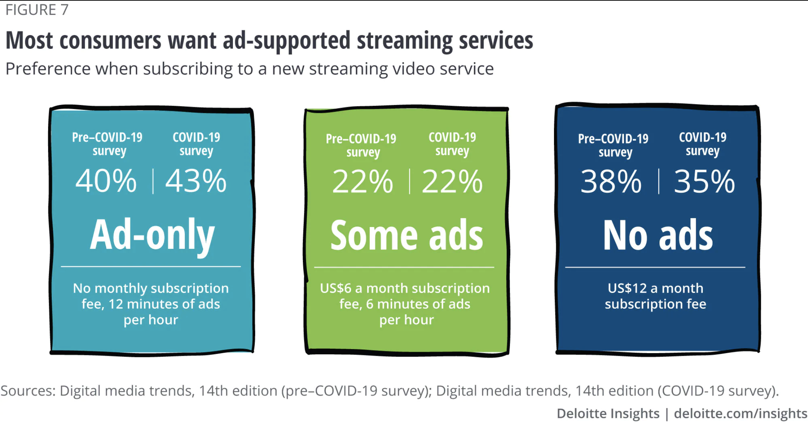

# Critique by Design

## The original visualization

**Background:**
I found this original visualization in the [Digital media trends survey, 14th edition](https://www2.deloitte.com/us/en/insights/industry/technology/digital-media-trends-consumption-habits-survey/summary.html) on [Deloitte Insight](https://www2.deloitte.com/us/en/insights.html). The article presents the change of consumer preference on paid media subscriptions before and since COVID-19 based on their pre-COVID-19 and COVID-19 survey. The visualization intends to showcase that U.S. consumers prefer cheaper, ad-supported streaming video options both before and since the pandemic, while there is also a small increase in ad-supported streaming video options since the lockdown. I selected this visualization because I found there are many improvements could be made to increase the overall clarity of the visualization. 

## Critique

### Describe your overall observations about the data visualization here. What stood out to you? What did you find worked really well? What didn't? What, if anything, would you do differently?

**Things that stood out:**
- The boldface label of “ad-only,” “some ads,” “no ads” immediately draws my attention to the visual when I was reading the article.
- The color choice is visually appealing and eye-catching. The color theme of this visual matches well with the rest of the visuals in the article. 

**What I liked:**
- The hierarchy of text works well on emphasizing the key points of the data (“ad-only,” “some ads,” “no ads”).
- The visualization includes a brief explanation of the monthly subscription fee and minutes of ads for each category.

**What I disliked:**
- The visual representation makes it difficult to interpret the main message of “most consumers want ad-supported streaming services” at first glance. Since those “consumers want ad-supported streaming services” are those who prefer “ad-only” and “some ads,” the visual requires readers to add these two groups and do the math on their own to understand the message.
- The visual form doesn’t work well on representing proportion.
- The overuse of color distracts readers, especially the dark blue color for the “no ads” category. Since readers’ attention often firstly draws to darker colors, the dark blue really takes away the attention of the other two categories. 
- The design causes back and forth, parallel eye travel across the boxes to read the percentage.
- The repeated use of the text “Pre-COVID-19” and “COVID-19.”
- The title is quite vague since it fails to address the point that the data is collected domestically within the United States.

**What I would change:**
- Change the visual to a stacked bar chart or a pie chart to better represent proportion.
- Add “ad-only” and “some ads” into one big category to match the main subject and convey a clearer message.
- Reduce the use of colors to draw attention to the ad-supported streaming categories.
- Change the title of the visual to be more specific and informative.

### Who is the primary audience for this tool? Do you think this visualization is effective for reaching that audience? Why or why not?

The primary audience for this visualization is the reader of Deloitte Insights and also people who has interest or work in the entertainment/media streaming industry.

I think this visualization is moderately effective for reaching its audience since it does a quite good job of providing useful, complete, and visually pleasing information although it still needs to improve on the level of perceptibility, intuitiveness, and engagement. Firstly, the data about consumers’ ad preferences ties closely with the entire article meanwhile the visual also includes a good amount of crucial information. Speaking of the aesthetic quality, the visualization overall is visually pleasing. However, although the visualization does include accurate and valid measurements, it fails to display the information in an appropriate manner so the readers might have a hard time understanding the message at the first glance. Therefore, low perceptibility and intuitiveness level would potentially decrease readers’ engagement level despite that the visualization is quite beautifully designed.

### Final thoughts: how successful is this method at evaluating the data visualization you selected? Are there measures you feel are missing or not being captured here? What would you change? Provide 1-2 recommendations (color, type of visualization, layout, etc.)

Overall, I think this critique method is quite successful. This critique has led me to think about how I interpret the visualization at my first glance, how long did I digest the data, and how well did the visual represent the data. Although the method really helped me to consider the effectiveness of chart based on the related criteria, I feel that it doesn’t specify the critique on visual components such as the use of color and the type of chart. Therefore, I recommend including and rate these specific visual components under each criteria. For instance, we can include the type of chart and the use of color under the category of perceptibility and evaluate perceptibility based on the components.

## Redesign of the visualization

### Process and wireframing

### Feedback on wireframes

**Friend 1:**
- "i d."
- "The use of color of your redesign makes the main subject much clear. I had a hard time picking the main point on the original graph."
- ""

**Friend 2:**
- "ed."

**Takeaways:**
Their feedback helped me to think 

### Re-designed visualization
