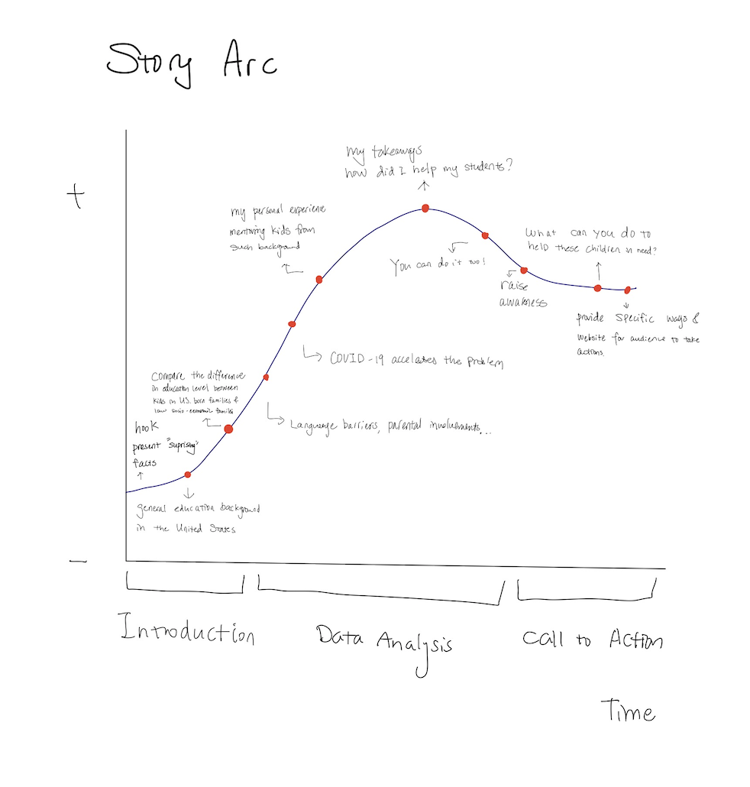
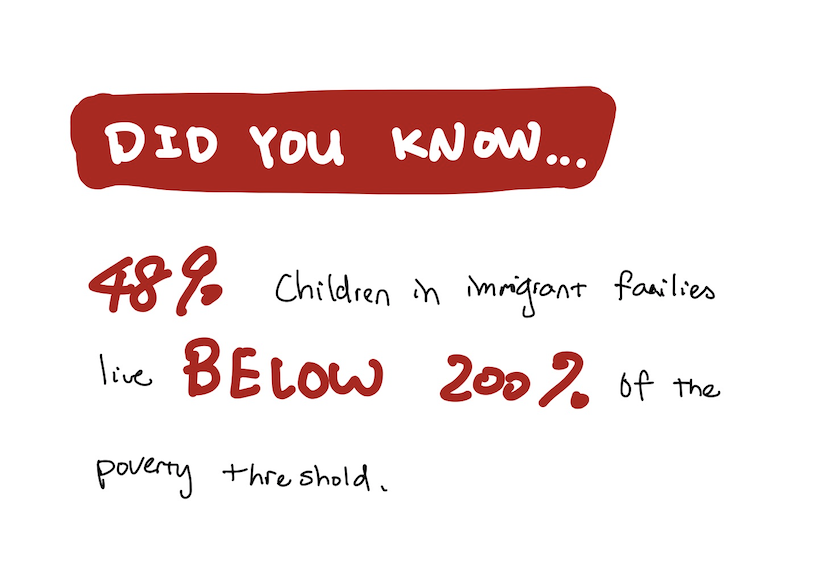
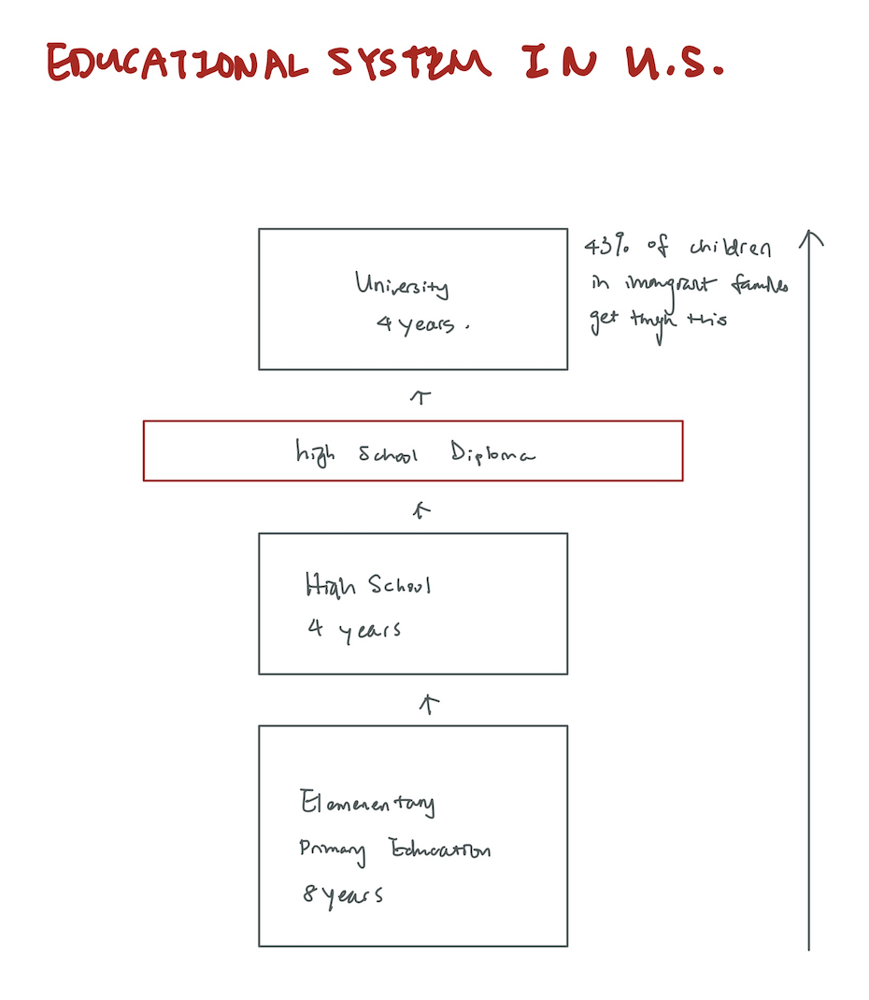
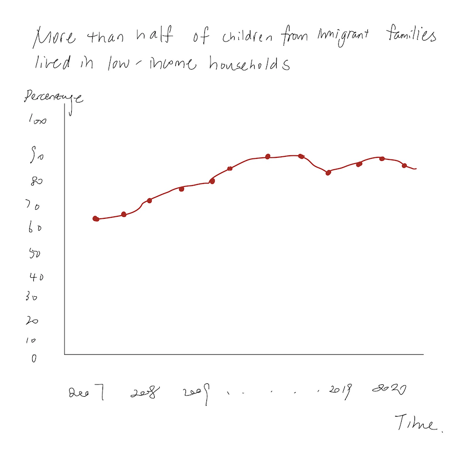
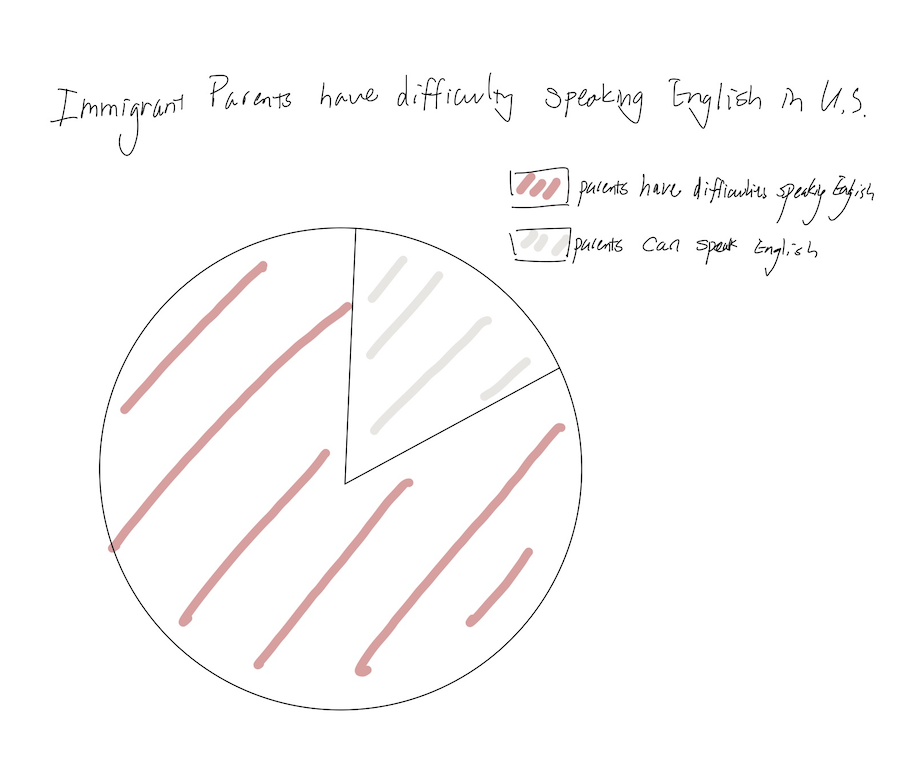

# Final Project Proposal

## Supporting the educational needs of students from low socio-economic status backgrounds in the United States

### Summary

For my final project, I decided to focus on the educational problem for children from  low socio-economic status backgrounds in the United States. More specifically, I would focus on chidren from lower-income, immigrant families. Compared to kids in U.S.-born families, kids in immigrant families are more likely to grow up in low-income households. Many of their parents have difficulty speaking English and low educational attainment. Due to the socioeconomic disadvantages, children from such families face limitations in education and language. In my project, I will discuss the issue in detail and I will convey the story to my audience by visualizing the data I collected from reliable sources such as the Kids Count Data Center, Urban Institute, and World Education News + Reviews. 

### Insipration

The project was initially inspired by my voluntary teaching experience last year. In 2019, I spent one year mentoring two kids from lower-income immigrant families in San Diego, California. During the time I spent with my mentees, I found that both of them were facing difficulties such as language barriers and lack of parental involvement. Therefore, I want to use this project to show my readers the obstacles in education and language that students from low socio-economic status backgrounds are facing and raise their awareness.

### Project Structure

**Story Arc**

**Hook**
- I would first present some facts to catch the readers' attention.
- For instance, "48% children in immigrant families live below 200% of the poverty threshold." 
- Data: [Kids Count Data Center](https://datacenter.kidscount.org/updates/show/244-immigrant-families-and-kids-see-economic-gains)

**Background Introduction**
- Introduce the overall education system in the United States.
- Data: [World Education News + Reviews](https://wenr.wes.org/2018/06/education-in-the-united-states-of-america)

**Compare the difference in education level between kids in U.S.-born families and kids in immigrant, lower-income families**
- Introduce the problem. 
- Data: [World Education News + Reviews](https://wenr.wes.org/2018/06/education-in-the-united-states-of-america)

**More Than Half of Kids in Immigrant Families Lived in Low-Income Households**
- Present the scale of the problem through data visualizations. 
- Data: [Kids Count Data Center](https://datacenter.kidscount.org/updates/show/189-more-than-half-of-kids-in-immigrant-families-lived-in-low-income-households-in-2016)

**Children in immigrant families in which resident parents have difficulty speaking English**
- Explain the issue through geographic and demographic factors.
- Data: [Kids Count Data Center](https://datacenter.kidscount.org/data/map/132-children-in-immigrant-families-in-which-resident-parents-have-difficulty-speaking-english?loc=1&loct=2#2/any/true/false/37/any/479/Orange/)

**COVID-19 further accelerated the problem**
- Children from low socio-economic status are less to have access to a computer and an internet connection to access the school works.
- Data: [OECD](https://www.oecd.org/coronavirus/policy-responses/what-is-the-impact-of-the-covid-19-pandemic-on-immigrants-and-their-children-e7cbb7de/)
- Data: [The Hill](https://thehill.com/opinion/immigration/515126-covid-19-include-immigrant-families-and-children-in-relief-effort)

**My personal experience mentoring students from low socio-economic status backgrounds**
- I would share my experience, takeaways, and include pictures that I took with my students to add a personal touch to the story and convey my readers.
- What did I do to help my students? How did they grew from this experience?

**Call to action**
- What can you do to help those students? 
- I plan to include specifc website.

### Initial sketches

**Hook**

**Background Introduction**

**Visualizing the problem**

### Data Sources

Below is a list of data sources I found that I will be using for the project. I intend on deriving my contents and visualizations from here meanwhile I will also do more research along the way.

- World Education News + Reviews: https://wenr.wes.org/2018/06/education-in-the-united-states-of-america
- Kids Count Data Center: https://datacenter.kidscount.org/updates/show/189-more-than-half-of-kids-in-immigrant-families-lived-in-low-income-households-in-2016
- Kids Count Data Center: https://datacenter.kidscount.org/data/map/132-children-in-immigrant-families-in-which-resident-parents-have-difficulty-speaking-english?loc=1&loct=2#2/any/true/false/37/any/479/Orange/
- Kids Count Data Center: https://datacenter.kidscount.org/updates/show/244-immigrant-families-and-kids-see-economic-gains
- Kids Count Data Center: https://datacenter.kidscount.org/updates/show/264-us-foster-care-population-by-race-and-ethnicity
- https://www.apa.org/pi/ses/resources/publications/education
- Urban Institute: https://www.urban.org/sites/default/files/publication/94546/child-care-choices-of-low-income-immigrant-families-with-young-children.pdf
- OECD: https://www.oecd.org/coronavirus/policy-responses/what-is-the-impact-of-the-covid-19-pandemic-on-immigrants-and-their-children-e7cbb7de/
- The Hill: https://thehill.com/opinion/immigration/515126-covid-19-include-immigrant-families-and-children-in-relief-effort
- American Psychological Association: https://www.first5california.com/en-us/services/immigrant-family-resources/

### Method and medium

To design my visualizations based on the data that I collected, I will mainly rely on using Flourish and Tableau. 

I will use Shorthand, this is also the platform I will present my work on.
