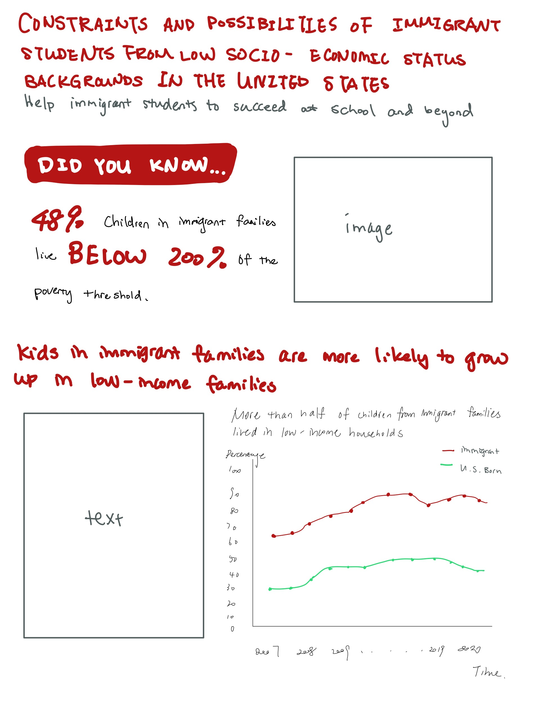
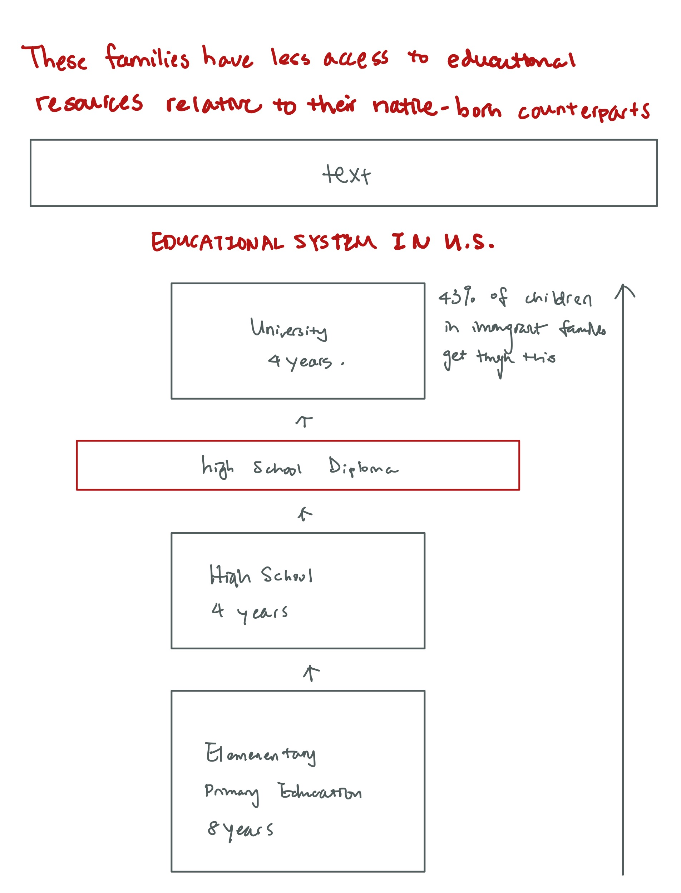
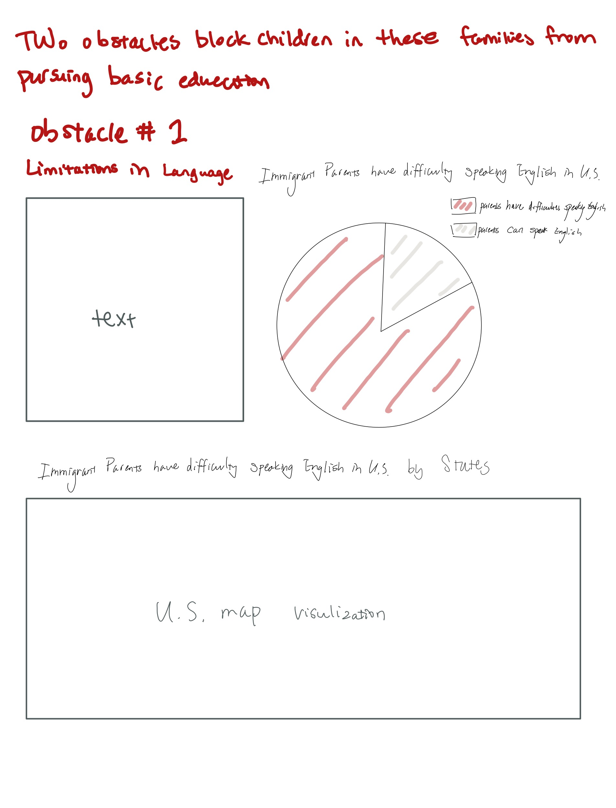
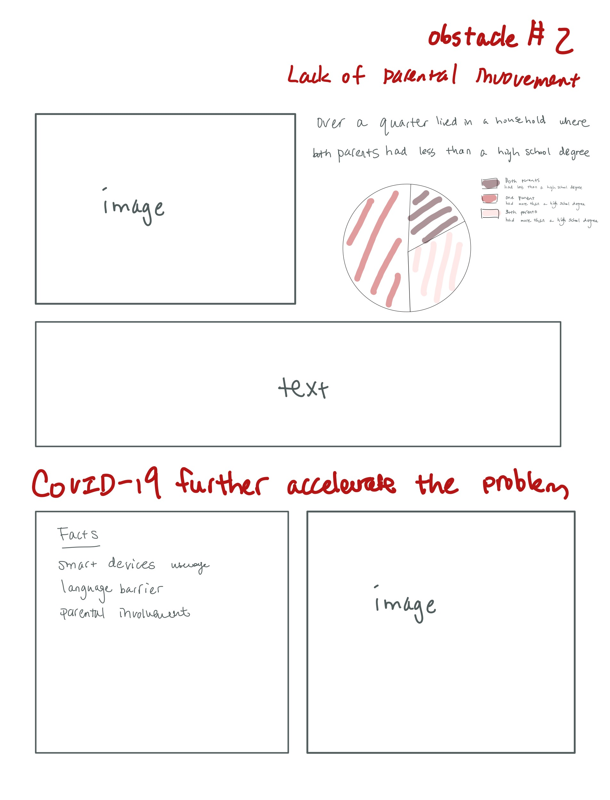
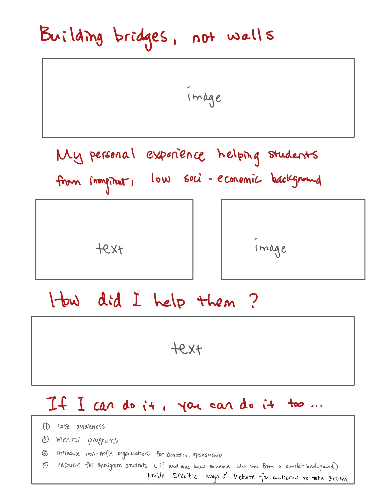

# Part II: Wireframes, storyboards, moodboards and user research

## Wireframes and storyboard

For my wireframe and storyboard, I expanded the wireframes I created in Part I by adding more supporting data and designing a visual walk-through for my final shorthand website. However, the visualizations and text are just a preview of the final version in shorthand. For some visualization such as the U.S. map, I would rely on Flourish or Tableau so there will be more visualizations and longer text/data facts in my final product. Also, some of the text I included are my organized thoughts for the storyboard; hence they may not appear in shorthand.

## User research protocol

### Target audience

My target audience is mainly adults who live in the United States who understand the importance of basic education. 

**Key demographics**
- Age range: 18 - 60, approximately
- Gender: Both male and female
- Location: USA, especially West Coast
- Education: From first year college students to working people

### Approach to identifying representative individuals to interview

Based on the key demographics that I concluded, I aimed to find individuals who match the above categories. To get a broad perspective and some more diversified feedback, I decided to reach three individuals with various backgrounds. My group of interviewees includes a graduate student majoring in Data Science (male, 23, originally from San Diego), a high school teacher (female, 29, originally from Miami), and an undergrad student (female, 19, based in Pittsburg).

### Interview script
**Introduction**

Thank you so much for agreeing to participate! I’m designing a website and here is my initial draft. Please take a look and let me know what your first impressions are. And if it’s okay, I also like to ask a few questions about your understanding of it. My goal today is to get some feedback before my final version. I hope to know what makes sense and what’s confusing so there are no wrong answers for you!

**Questions**
- Can you summarize what the storyline is telling you in just one or two sentences?
- Who do you think the intended audience is for the site?
- Does the storyline flow smoothly? 
- Is there anything you would change or do differently?
- Is there any other information that you thought was lacking? If so, what would you have liked to see?
- Are all the visualizations appealing and clear? 
- Does the call to action resonate with you?

**Closure**

Thank you so much! I really appreciate you for taking the time to offer valueble feedback and I will incorporate the recommendations you’ve suggested into my final draft.

### Interview

**Interview #1, a graduate student majoring in Data Science**

| Question | Answer |
| ------ | ------ |
| Can you summarize what the storyline is telling you in just one or two sentences? | The students from low socio-economic status backgrounds in the United States are facing difficulties to get fundamental education. |
| Who do you think the intended audience is for the site? | U.S. citizens. |
| Does the storyline flow smoothly?  | I think it worked well. Using those surprising facts as a hook especially drew my attention to your story. |
| Is there anything you would change or do differently? | I don't think so. I think the overall order of your story makes sense and I would like to see your final website. |
| Is there any other information that you thought was lacking? If so, what would you have liked to see? | I understand that this is just a draft. But I would like to see more data to support your story for your final website. |
| Are all the visualizations appealing and clear? | Yes. But for the educational system visualization graph, I think you should reverse the order. Because you need to consider that people scroll down websites so your visual should also start from the top. |
| Does the call to action resonate with you? | Yes, it does. |

**Interview #2, a high school teacher**

| Question | Answer |
| ------ | ------ |
| Can you summarize what the storyline is telling you in just one or two sentences? | The story shows the obstacles to immigrant students including language barriers and parent involvement. |
| Who do you think the intended audience is for the site? | Individuals who live in the United States. |
| Does the storyline flow smoothly?  | Yes. |
| Is there anything you would change or do differently? | I would pick another data visualization for lack of parental involvement. Although the educational backgrounds of immigrant parents do relate somehow, there should be better data about parental involvement to support your argument. |
| Is there any other information that you thought was lacking? If so, what would you have liked to see? | I would like to know more about how the pandemic is affecting these families. |
| Are all the visualizations appealing and clear? | Yes. One thing to notice is the choice of red color. I personally do not feel comfortable with only red color in the viz. |
| Does the call to action resonate with you? | Yes, it does. Especially since I work in the educational community, I feel really connected to your detailed suggestions. |

**Interview #3, an undergrad student**

| Question | Answer |
| ------ | ------ |
| Can you summarize what the storyline is telling you in just one or two sentences? | It shows me the educational circumstances of children from low-income immigrant families, and also potential factors that caused this situation. |
| Who do you think the intended audience is for the site? | U.S. citizens from middle class or above. |
| Does the storyline flow smoothly?  | Yes, it does. It starts with the description of the problem, and transits to the causes, and finally the potential solutions. |
| Is there anything you would change or do differently? | Yes, it will be better if there are more specific cases included. For example, a specific community that suffers from this problem. |
| Is there any other information that you thought was lacking? If so, what would you have liked to see? | Probably your personal experience part. Would like to know more about how you connect and help those students. |
| Are all the visualizations appealing and clear? | Yes, they are clear enough for me to understand. |
| Does the call to action resonate with you? | Somehow. I believe it has something to do with personal experience. If one knows relative or friend suffer from the problem around them, one will resonate more. |

### Findings from interviews

- 

### Changes you plan on implementing to your visualizations next week to address the issues identified. 

## Moodboard
